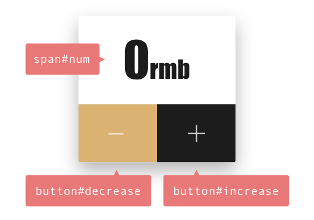

# 8.15主题内容-MVVM双向数据绑定

这次先简单立出比较重要的东西，具体一些细节的东西我们以后在继续总结

## 什么是MVVM，数据流方式

1.首先是软件架构模式，与MVC,MVP类似，为了解决一类问题而总结出来的一种抽象设计方法。一种架构模式往往用了多种设计模式。
C(Controller)、P(Presenter)、VM(View-Model)、MV(Model-View)

### Model
在个人理解中，model是数据单元层,Java中DAO就似乎是担任这个职责（其实我已经忘了）

- 将业务逻辑的数据变量进行定义

- 基本数据单元的函数操作

- 可能有get set的一些扩展

### View

View层显然就是做渲染的层面,包括所有关于

- 从Model数值>渲染到界面过程中相关的函数

- 对应用户输入和操作的监听响应函数

### MV*

MV*的模式中 *就是替换和升级的方向，因为M和V总是需要连接的，如何让连接更方便直观，是模式的方向和目标。(所以你也可以理解为其实*都一样,只是书写方式的变化)

嘛，我就不追溯什么历史了，直接来感受
#### MVC
在Java很早学还用不知道什么内置的库来写桌面程序的时候，以上model和view以及MVC的概念就显示的比较明显,通过controller来协调model和view的关系，控制整个应用程序的流程。也是因为controller要协调两方，两方的所有接口都必须在这里得以转换进行连接。如果业务层的逻辑足够复杂，那事实上最终你会得到一个看起来应该可以自动生成的Model层，以及一个全是花瓶的View层，以及满满的逻辑的臃肿的C层。当然其实这并没有什么问题，M与V的关系的确通过C得到了解耦。我们来看这个数据更新流程。

>MVC的一般流程是这样的：View（界面）触发事件--》Controller（业务）处理了业务，然后触发了数据更新--》不知道谁更新了Model的数据--》Model（带着数据）回到了View--》View更新数据

#### MVP

但做的不够好，因为M和V确实没有完全解耦开，V的数据展示依然是需要从Model拿（或者说他触发主动给）

有人说MVP中的P其实是对原有C的接口代理抽象。其实这不是很关键，关键在于这个代理其实是Model数据层的代理。他完全切断了MV之间的联系，让V完全感觉不到M的存在，只与P进行所有的通信

>MVC和MVP的区别是：在MVP中View并不直接使用Model，它们之间的通信是通过Presenter (MVC中的Controller)来进行的，所有的交互都发生在Presenter内部，而在MVC中View会直接从Model中读取数据而不是通过 Controller。

#### MVVM

但是MVVM完全不是这个回事，应该说VM将MVVM转化成了V-M
我个人理解MVVM是MVP一种技术上的演变导致的高级版本
其高级在于，VM与P的区别在于，VM与V的通信是直接的，VM与M的通信也是直接的，这能直接到让人有“绑定”V-M的感觉的根源，
是由于双向绑定的实现。

所有model层的变化可以直接显示在view层上
所有view层的变化可以直接响应到model层上
然而，View不知道Model的存在，ViewModel和Model也察觉不到View。

感觉这是一体的。
感觉这应该在哪里见过。
感觉这其实就应该这样。

其实这是一种很直觉的东西，我输入这几个字在编辑器中，编辑器就会显示这几个字，退格就会删除，这种反馈是自然的，流畅的。
MV之间牢牢的绑在一起，在变化中一体，在职责中又各自分离。

## MVVM与数据双向绑定的关系

双向的目标就是model和view，数据和视图在变化中一体，在职责中却分离
> 双向数据绑定，可以简单而不恰当地理解为一个模版引擎，但是会根据数据变更实时渲染。——《界面之下：还原真实的MV*模式》

## 目前主流框架实现MVVM的方式

目前一些主流的前端框架实现数据绑定的方式大致有以下几种：

- 数据劫持 (Vue)

- 发布-订阅模式 (Knockout、Backbone)

- 脏值检查 (Angular)

## 参考资料

[浅析前端开发中的 MVC/MVP/MVVM 模式](https://juejin.im/post/593021272f301e0058273468?utm_source=gold_browser_extension)