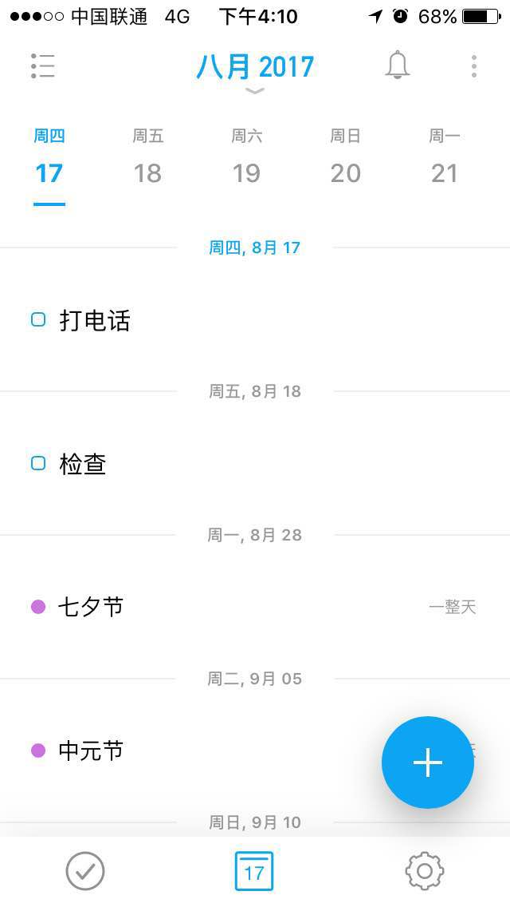
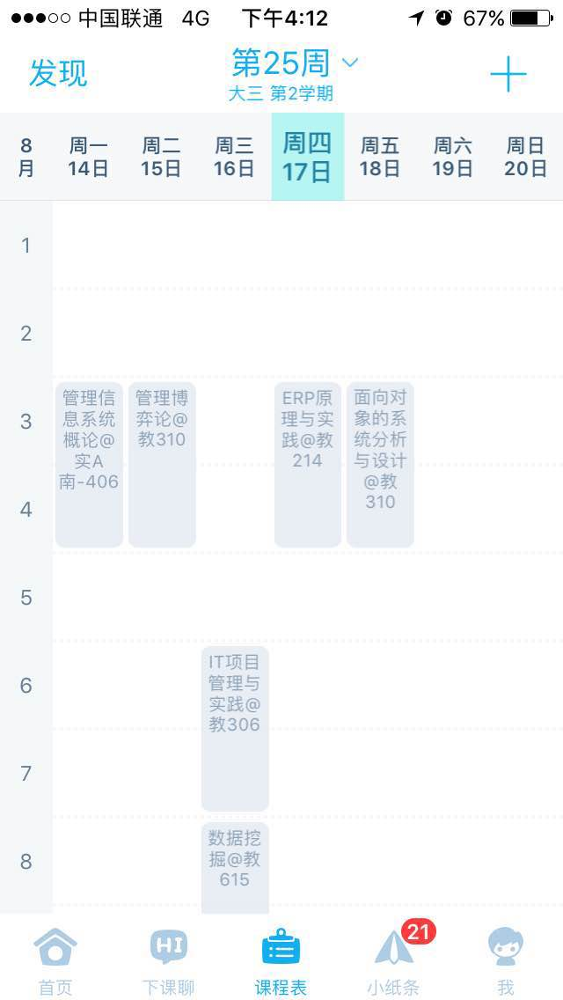

# 需求分析

## UI显示分析

### 首屏

> 关注今日安排

- 今天的日期，以及学期的第几周
- 今天的课程(时间安排)信息
- 展开

### 次屏

> 关注本周安排

- 查看本周是学期的第几周
- 查看本周的课程信息

查看非本周的课程

### 课程单元

- 课程首要信息应包括名称,时间,教室

modal弹窗
查看某一课程的具体信息，教师，教室，哪些教学周需要上课

次关心的功能：
课程考试时间，教室

最不关心的功能：
查看日历信息

功能：
1.	日历模板，清晰的分出年月周，具体到天时，展示各个上课时间分段
2.	用户登录系统，接收的账号密码用于登录教务系统
3.	课程爬虫，登录教务系统后把课程信息的文本抓到，分析出各个课程的上课周，教室，教师信息，（顺便一起抓考试安排就更好了）
4.	课程信息展示，将分析好课程信息，展示到日历中
5.	详细课程信息，在日历中点击具体课程将展示该课程详细的信息
6.	数据库储存信息，
每一个课程在数据库中存为一行，
每个课程表除了本身课程信息外，要需要对应的，学级，学院，专业，班级，学期。

